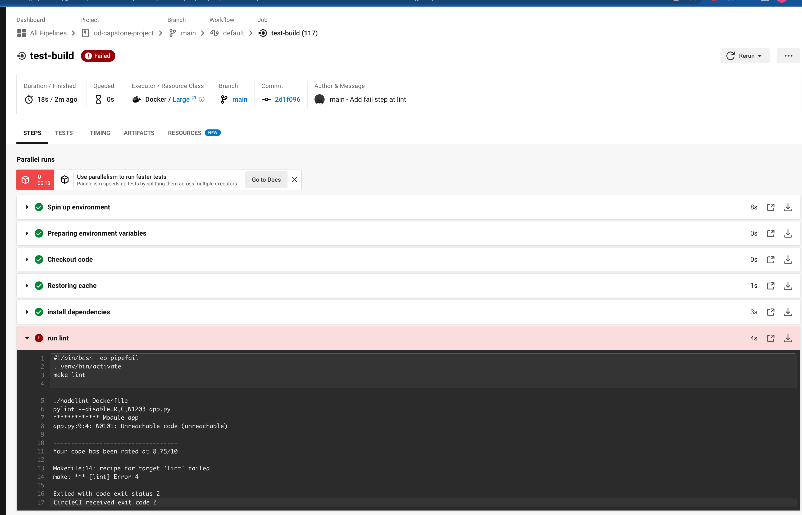
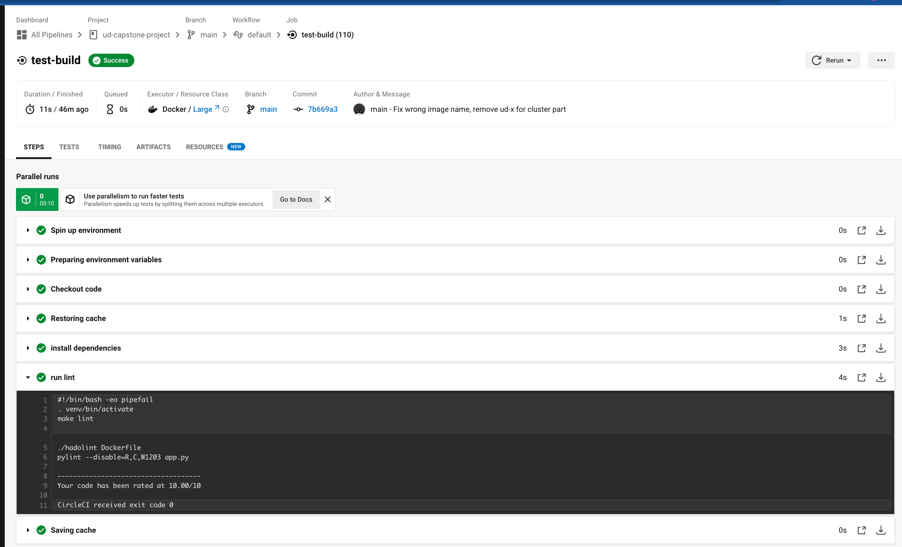
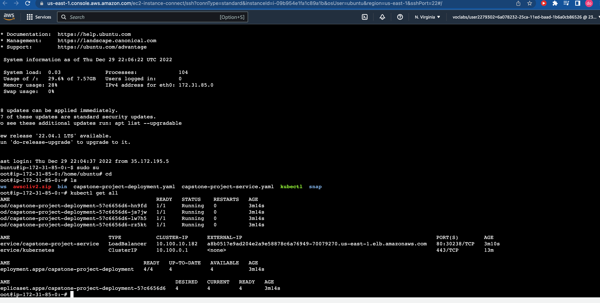

# Udacity Cloud DevOps Engineer Capstone Project

Capstone project for Udacity's "Cloud DevOps Engineer" Nanodegree Program that represents last final Capstone project and the Cloud DevOps Engineer (CDE) Nanodegree at Udacity.

## What did I learn?

In this project, I applied the skills and knowledge I developed throughout the Cloud DevOps Nanodegree program that include:
- Using Circle CI as a CI/CD
- Building pipelines with CI/CD
- Working with CloudFormation to deploy clusters, Ansible for deployment
- Building Kubernetes clusters, understand how cluster communicate with nodes
- Building Docker containers and publish to DockerHub
- Working in AWS

## Tolls Used
- GitHub
- AWS, AWS-CLI
- Python3
- Flask framework
- Pylint
- Docker, DockerHub
- Kubernetes CLI (kubectl)
- EKS
- CloudFormation

## APP
Using Flask framework and render simple webpage.

## K8s Cluster
AWS CloudFormation will be used to deploy K8s Cluster. There are 4 main tasks:
- Network: Ensure that nodes can integrate with cluster, define by network.yml
- EKS service: to create EKS cluster, define by cluster.yml
- Nodes: Set or rule that defined how instances operate for EKS - cluster, define by nodegroup.yml
- Management: Configure, manage Cluster, deploy all services, define by management.yml


#### List of deployed Stacks by CloudFormation:


#### List of deployed Instances:


## CI/CD Pipelines with CircleCi

CI/CD Pipeline by CircleCI to test, deployed automatically to the Cluster using Ansible.

#### Pipelines:


## Code quality by linting using Pylint and Hadolint

This process makes sure passed code quality and coding convention.

#### The output for step fails:




#### The output step pass:




## Access the App via Management

After the EKS-Cluster has been successfully configured using Ansible within the CI/CD Pipeline, 
Here is the deployment for all services:

```
$ kubectl get all
NAME                                              READY   STATUS    RESTARTS   AGE
pod/capstone-project-deployment-57c6656d6-hn9fd   1/1     Running   0          3m14s
pod/capstone-project-deployment-57c6656d6-js7jw   1/1     Running   0          3m14s
pod/capstone-project-deployment-57c6656d6-lw7h5   1/1     Running   0          3m14s
pod/capstone-project-deployment-57c6656d6-rz5kt   1/1     Running   0          3m14s

NAME                               TYPE           CLUSTER-IP      EXTERNAL-IP                                                             PORT(S)        AGE
service/capstone-project-service   LoadBalancer   10.100.10.182   a8b0517e9ad204e2a9e58878c6a76949-70079270.us-east-1.elb.amazonaws.com   80:30238/TCP   3m10s
service/kubernetes                 ClusterIP      10.100.0.1      <none>                                                                  443/TCP        13m

NAME                                          READY   UP-TO-DATE   AVAILABLE   AGE
deployment.apps/capstone-project-deployment   4/4     4            4           3m14s

NAME                                                    DESIRED   CURRENT   READY   AGE
replicaset.apps/capstone-project-deployment-57c6656d6   4         4         4       3m14s                                                               443/TCP        80m
```

Public DNS: http://a8b0517e9ad204e2a9e58878c6a76949-70079270.us-east-1.elb.amazonaws.com/

